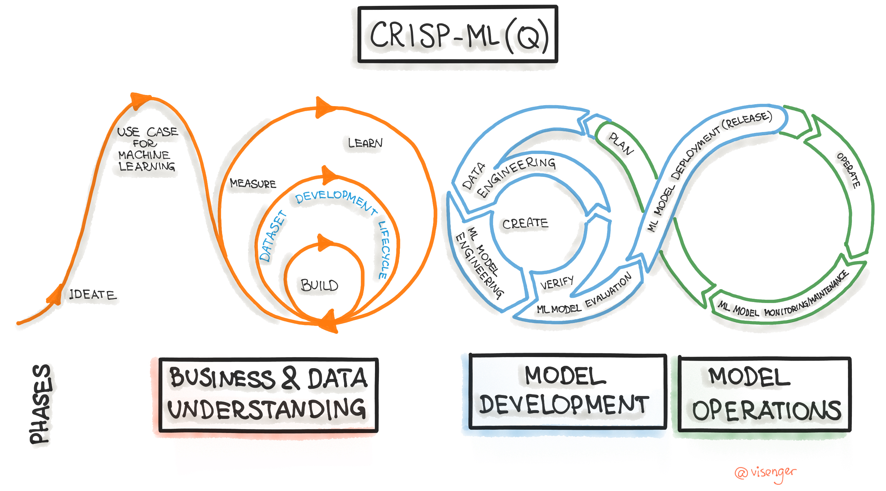

[[toc]]

#### Overview

The emergence of machine learning (ML) and artificial intelligence (AI)-enabled systems has exposed new attack vectors and new types of vulnerabilities not covered by traditional cybersecurity practices. As predictive models, classification models, large language models (LLMs), and other generative technologies become more common, they are being increasingly targeted by attackers aiming to produce incorrect predictions, evade content policies, steal intellectual property, and compromise private data, along with executing traditional cybersecurity attacks. Threats to AI comprise an active and growing field that requires a technical and operational response.

_AI Security_ can be defined as the tools, strategies, and processes implemented that identify and prevent threats and attacks both to and from AI or AI-embedded systems. In this 101, we describe the most common threats to AI systems and how to design operating models with AI Security in mind. We discuss realistic threats documented within MITRE ATLAS as well as active areas of research in AI Security, red team and blue team activities, and risk mitigation throughout the full machine learning model lifecycle.

**Additional context for those with a background outside of machine learning:**

Machine learning models generally have two stages in their development, each with unique security vulnerabilities and mitigations. During the training stage, data is collected and processed, and a model is selected and fitted to the data, commonly called training or fine-tuning. After validating the model’s performance, the inference stage begins, where users or applications submit queries. The model then responds with predictions, classifications, or generative content, called inferences. When an inference occurs with a deployed model, live data is often collected to improve the model and monitor its real-world performance. The following diagram illustrates this pipeline:

<figure>
  

    
    

    <figcaption class="text-caption text-center">
    Figure 1: Machine learning development pipeline.</figcaption>
</figure>

#### Machine Learning Attacks

Attacks on machine learning systems can occur during both training and inference. They generally are categorized as either white-box attacks or black-box attacks. In white-box attacks, adversaries have in-depth knowledge about the model architecture and weights and can customize attacks specifically for the system, increasing the likelihood of a successful attack. In black-box attacks the adversary only has access to the inputs and outputs to a system and may not be able to easily differentiate between AI-enabled components and traditional data processing components within the system, decreasing the likelihood of a successful attack. In gray-box attacks adversaries have partial information about the system such as data preprocessing.

Below are high-level descriptions of some of the most common types of adversarial attacks on AI systems and which stage of the pipeline they target. This chart can be considered a high-level overview of the most common methodologies used by adversarial actors. For a comprehensive list we recommend exploring the full [ATLAS matrix](/matrices/ATLAS).

| Attack 		        | Overview	| Type |
| :---:			        | :---      | :---:|
| Model Poisoning   | Attacker contaminates the training data of an ML system to get a desired outcome at inference time. With influence over training data an attacker can create "backdoors" where an arbitrary input will result in a particular output. The model could be "reprogrammed" to perform a new undesired task. Further, access to training data could allow the attacker to create an offline model and execute a Model Evasion. Access to training data could also result in the compromise of private data. | Training |
| Model Evasion     | Attacker elicits an incorrect response from a model by making small modifications to the query. These attacks can be targeted, where the attacker tries to produce a specific classification, or untargeted, where they attempt to produce any incorrect classification. | Inference |
| Functional Extraction | Attacker recovers a functionally equivalent model by iteratively querying the model. This allows an attacker to examine the offline copy of the model before further attacking the online model. | Inference |
| Model Inversion | Attacker reverse engineers a model and extracts sensitive information about the model architecture or training data. This can be a successful attack on its own or can be used to perform other attacks such as Model Evasion. | Inference |
| Traditional Cyber Attacks | Attacker uses well-established Tactics, Techniques, and Procedures (TTPs) from the cyber domain to attain their goal. These attacks may target model artifacts, API keys, data servers, or other foundational aspects of ML compute infrastructure distinct from the model itself. | Both |

#### Operating Model

##### The Model Lifecycle

Developing and deploying a robust AI or ML model involves multiple phases of effort that typically involve different teams, developers, and stakeholders. Just as with the Software Development and Operations (DevOps) methodology, the field of Machine Learning Operations (MLOps) defines best practices and tools for deploying reliable, reproducible, and adaptable models. A good example of a model development pipeline with a MLOps focus is [CRISP-ML(Q)](https://ml-ops.org/content/crisp-ml), the Cross-Industry Standard Process for the development of Machine Learning applications with Quality assurance.

CRISP-ML(Q) defines six phases in the model lifecycle:

  1.	Business and Data Understanding
  2.	Data Engineering (Data Preparation)
  3.	Machine Learning Model Engineering
  4.	Quality Assurance for Machine Learning Applications
  5.	Deployment
  6.	Monitoring and Maintenance

<figure>
  

    
    

    <figcaption class="text-caption text-center mb-4">
    Figure 2: "<a href="https://ml-ops.org/content/crisp-ml">The Machine Learning Development Life Cycle Process</a>" by <a href="https://github.com/visenger">visenger</a>. <a href="https://creativecommons.org/licenses/by/4.0/">CC BY 4.0</a>.
    </figcaption>
</figure>

Each phase begins with defining the requirements and constraints of the task, and cycles through a process of identifying risks, risk evaluation, and risk mitigation until requirements are met. Teams often revisit earlier phases and loop through the pipeline multiple times as stakeholders define new requirements and constraints. It is expected that during the “Monitoring and Maintenance” phase that the process will return to the earlier development phases in response to changing real-world conditions, such as in response to concept drift and data drift, or in response to the actions of bad actors.

In ATLAS we tag [mitigations](/mitigations) with phases from the CRISP-ML(Q) lifecycle, to help the relevant teams involved with each phase identify known risks that could impact their task requirements, and possible ways to respond. We also encourage interested parties to read [the original paper on CRISP-ML(Q)](https://arxiv.org/pdf/2003.05155.pdf).

##### Red Teams and Blue Teams

Red team exercises are a common practice in cybersecurity, where a dedicated red team aims to uncover weaknesses and vulnerabilities in a system. Similarly, a blue team aims to counter the red team attacks and build up system defenses and resilience. Red team exercises are becoming more common as part of machine learning and AI security, especially in response to the rise of LLMs and associated prompt injection and jailbreaking attacks. Just as with its cybersecurity counterpart, AI red teaming can be organized within the [Build-Attack-Defend (BAD) framework](https://danielmiessler.com/p/red-blue-purple-teams/). The phases of the BAD framework are as follows:

  1.	Build—commonly performed by a dedicated yellow team of designers and developers, the build phase aims to produce a baseline system with a focus on performance, and often leaves vulnerabilities unaddressed.
  2.	Attack—during this phase the red team performs adversarial attacks and probes the baseline system for weaknesses.
  3.	Defend—the blue team responds to adversarial attacks by integrating mitigations within the baseline system and improving the overall security and robustness of the system.

While independent teams might be responsible for different phases, interdisciplinary teams commonly perform multiple roles within the BAD framework. Teams should also share information between the different phases so that project requirements and vulnerabilities can be properly relayed to the various developers.

##### Threat Models

Organizations should plan red team exercises with a risk-based assessment of the AI system. These red teams should consider various threat models where realistic vulnerabilities are identified along with the corresponding likelihood of a successful attack. The exercises should consider a variety of adversaries, from the least resourceful to the most resourceful. The least resourceful may have only black box access, while the most resourceful adversary may gain white box access. The objectives of the adversaries should be included in the threat model, which could involve compromising the system’s confidentiality, availability, or integrity. The attacks could be untargeted (aiming to produce random errors) or targeted (aiming to produce a specific decision from the model). Finally, the severity of the impacts of a successful attack should be considered when determining the necessity and scope of a red team exercise.

#### Research Areas

AI Security is a constantly evolving field with subfields emerging as the technologies mature. We describe recent developments in three notable sub-fields below:

##### LLM Security
Large Language Models (LLMs) are a particular category of natural language model trained on hundreds of billions of words and can generate text and, recently, images and videos in response to natural language prompts. They vaulted to public popularity with the release of OpenAI’s ChatGPT in November of 2022 due to their impressive performance on creative tasks such as content generation, style transfer, and text summarization.

From a security perspective, these systems introduce unique challenges to an ML pipeline due to the massive size of the training dataset and opaque internal architecture of the model. For example, indirect prompt injection attacks can be used to [extract a user’s personally identifiable information (PII)](/studies/AML.CS0021) or [influence the user to visit malicious websites](/studies/AML.CS0020). For sample adversarial techniques, see [LLM Prompt Injection](/techniques/AML.T0051), [Compromise LLM Plugins](/techniques/AML.T0053), and [LLM Jailbreak](/techniques/AML.T0054). A strong list of LLM security related papers, articles and tools can be found [here](https://llmsecurity.net/).

##### Hardware Security

Hardware security has been studied extensively in classical cybersecurity settings and is now being examined in relation to AI systems. Example hardware security attacks include:

1.	Side channel attacks—information about the system is deduced from alternative information streams such as voltage measurements or response timing,
2.	Fault injection attacks—systems are actively disrupted by faulty input data or physical environment disruptions, and
3.	Hardware Trojan attacks—malicious backdoors are inserted into the hardware of the systems including GPUs and other platform circuitry.

We refer interested technical readers to the following survey papers on this topic:
- [Zhou et al. (2021): Deep Neural Network Security From a Hardware Perspective](https://ieeexplore.ieee.org/abstract/document/9642246)
- [Xu et al. (2021): Security of Neural Networks from Hardware Perspective: A Survey and Beyond.](https://ieeexplore.ieee.org/document/9371637)

##### Policy

As the significance of vulnerabilities in AI systems becomes more widely known, policy makers and political leaders have been exploring the best way to balance interests of privacy and innovation. In the United States, the [Executive Order 14110](https://www.whitehouse.gov/briefing-room/presidential-actions/2023/10/30/executive-order-on-the-safe-secure-and-trustworthy-development-and-use-of-artificial-intelligence/) recently directed over 50 federal entities to take action across a range of AI policy areas.  Several federal agencies have also enacted guidance on AI in recent years (e.g., [GSA AI Guide for Government](https://coe.gsa.gov/coe/ai-guide-for-government/print-all/index.html), [DoD Responsible AI Strategy](https://www.defense.gov/News/Releases/Release/Article/3588743/cdao-releases-responsible-ai-rai-toolkit-for-ensuring-alignment-with-rai-best-p/)), but legislation over academic and private sector bodies remains a complex issue with technological, economic, and ethical considerations. The most effective way to balance these factors is an open research question. We list a few leading relevant publications on this topic below:

- [AI Risk Management Framework](tps://www.nist.gov/itl/ai-risk-management-framework), NIST
- [Guidelines for Secure AI System Development](https://www.ncsc.gov.uk/files/Guidelines-for-secure-AI-system-development.pdf), UK National Cyber Security Centre
- [A Unified Framework of Five Principles for AI in Society](https://hdsr.mitpress.mit.edu/pub/l0jsh9d1/release/8), Harvard Data Science Review
- [A Taxonomy of Trustworthiness for Artificial Intelligence, UC Berkeley Center for Long-Term Cybersecurity](https://cltc.berkeley.edu/publication/a-taxonomy-of-trustworthiness-for-artificial-intelligence/)
- [Ethics and Governance of Artificial Intelligence for Health](https://www.who.int/publications/i/item/9789240029200), World Health Organization
- [A Sensible Regulatory Framework for AI Security](https://www.mitre.org/news-insights/publication/sensible-regulatory-framework-ai-security), MITRE
- [Strengthening and Democratizing the US Artificial Intelligence Innovation Ecosystem: An Implementation Plan for a National Artificial Intelligence Research Resource](https://resourcecenter.cis.ieee.org/government/usa/cisgovph0020), National Artificial Intelligence Research Resource Task Force
- [Artificial Intelligence Bill of Rights](https://hai.stanford.edu/white-paper-stanford-hai-artificial-intelligence-bill-rights), Stanford University Human-Centered Artificial Intelligence
- [S.3572 Algorithmic Accountability Act of 2022](https://www.congress.gov/bill/117th-congress/senate-bill/3572), 117th United States Congress
- [EU Artificial Intelligence Act](https://www.europarl.europa.eu/news/en/headlines/society/20230601STO93804/eu-ai-act-first-regulation-on-artificial-intelligence), European Parliament

#### Summary and Conclusions

In this tutorial we covered the basics of machine learning and secure AI, both from a system-level and operations-level perspective. We also described the most common adversarial ML attacks commonly employed against modern machine learning systems, covered a standard operational lifecycle for an AI-enabled system, and covered emerging areas of research spanning engineering, linguistics, and policy-related domains. With this deeper understanding of the relationships between AI, cybersecurity, and policy domains, we encourage you to explore the additional resources MITRE offers on this topic:

- Our [Tactics](/tactics) and [Techniques](/techniques) pages list the methodologies adversaries use to infiltrate and/or compromise vulnerable AI systems. Our [Matrix](/matrices/ATLAS) organizes these potential vulnerabilities graphically and chronologically for easier visual understanding, and our [Mitigations](/mitigations) page contains information how to protect your systems against them.
- For examples of what these system attacks look like “in the wild”, check out our growing list of [Case Studies](/studies). We also have a publicly available [database of vulnerabilities found in common models](https://airisk.io).
- Have suggestions on how we can make ATLAS more relevant to you and your organization? [Contact us via Slack, LinkedIn, Email, or Github](/resources/contact). We also welcome case study contributions through our interactive [Case Study Builder tool](/studies/create).
